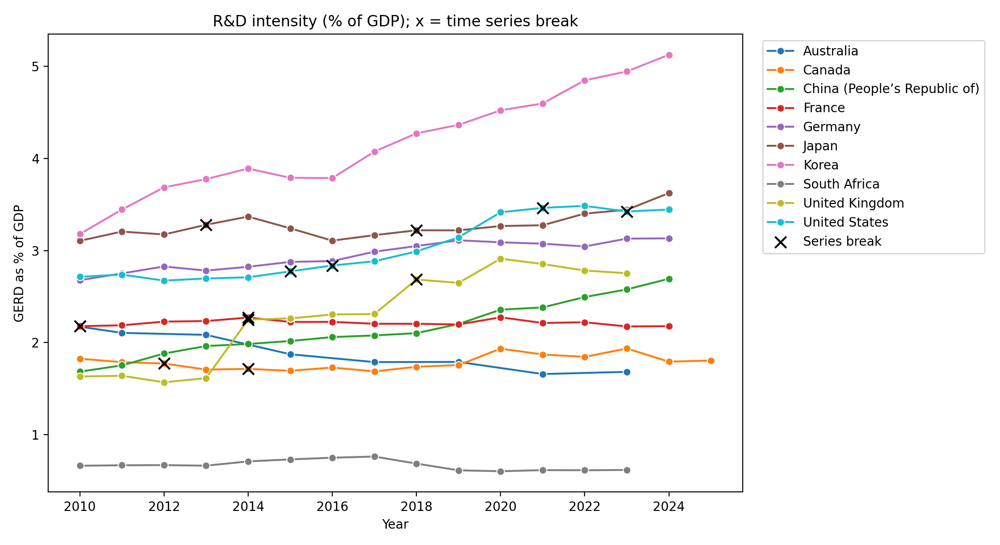
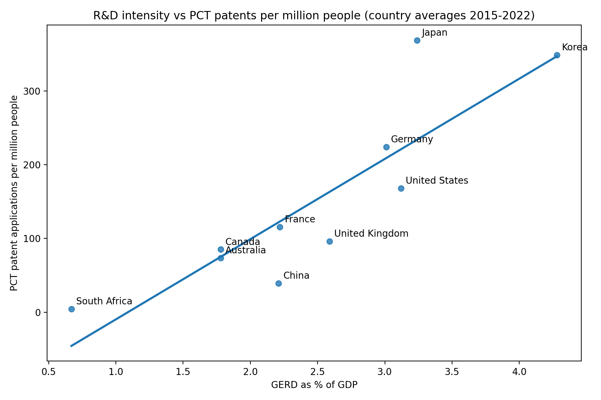

# Science, Technology & Innovation Performance: A Cross-Country Analysis Using OECD Data

## Overview
Analysis of R&D intensity and innovation indicators for 10 economies (Australia, Canada, China, France, Germany, Japan, Korea, South Africa, United Kingdom, United States) using the OECD Main Science and Technology Indicators (MSTI) database, retrieved through the public OECD SDMX API (no API key required).

## Research Questions
1. How does R&D intensity (GERD as % of GDP) vary across countries?
2. How has it changed since 2010?
3. Is R&D intensity associated with patent activity and researcher numbers?

## Data
- Source: OECD MSTI, dataset DSD_MSTI@DF_MSTI (retrieved 4 October 2026)
- Measures: GERD (% of GDP), PCT patent applications, researchers (per 1,000 employed), population
- Period: 2010 to latest available (2023 to 2025 depending on country)
- India is not in MSTI, so it is not included

## Methods
Data retrieval via SDMX API; cleaning and validation (duplicate checks, unit checks, handling of observation-status flags); patents scaled per million people; country averages over 2015-2022; Pearson and Spearman correlation, with and without Korea. A regression was deliberately not run, because n = 10 countries is too small for it to be meaningful.

## Key Findings
- Korea has the highest R&D intensity (5.1% of GDP in 2024) and the largest rise since 2010 (+1.95 percentage points). Among the five countries with series free of flagged breaks, China rose +1.01 and Germany +0.45; Australia fell -0.49 and South Africa was flat.
- R&D intensity is strongly associated with PCT patents per million people (Pearson 0.87, Spearman 0.92, n=10; Pearson 0.80 without Korea) and with researchers per 1,000 employed (Pearson 0.80, n=9).
- China files fewer patents per capita than its R&D intensity suggests; Japan files more.

## Limitations
- Only 5 of 10 countries have series with no flagged time-series break, so change rankings cover those five only; the UK has two breaks (2014, 2018) and its apparent rise is largely a measurement artefact.
- Latest years are provisional or estimated; countries end in different years; Australia reports every other year and has no researcher data.
- n=10: correlations are fragile and descriptive. They show association, not causation. Economic size, industry structure and patenting practices are uncontrolled confounders.
- PCT counts capture international filings only; per-capita scaling penalises very populous countries.
- Averages for 2015-2022 include some break-flagged years.

## Files
- `OECD_STI_Analysis.ipynb`: full analysis notebook
- `rd_clean.csv`, `country_summary.csv`: processed data
- `rd_intensity_trend.png`, `rd_vs_patents.png`: figures

## Future Work
Add India from the World Bank, expand the country set, and use panel regression with controls.

## Author
Vishal Pote. Data: OECD (subject to OECD terms of use). Code: MIT licence.
